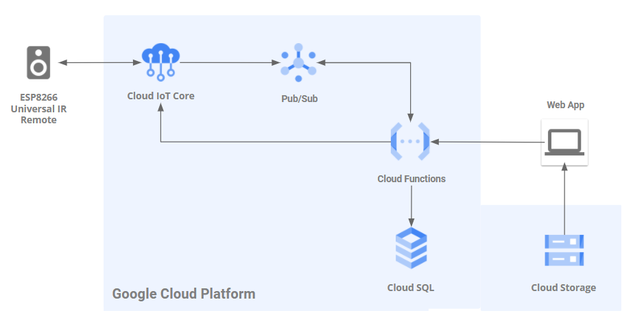
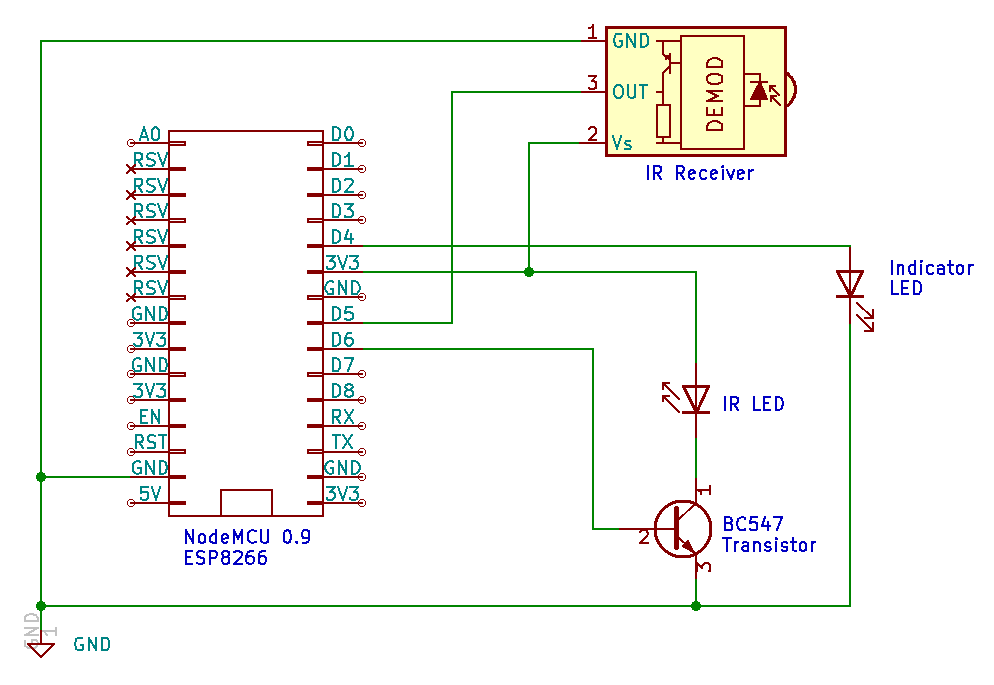

# Universal Smart Cloud IR Remote

Project with Naufal Rafi Hibatullah ([Github](https://github.com/naufalrafih)).

## Description

This is a project where we built an IoT device which sends infrared signals to other electronic devices and can also record IR signals from other devices.

The characteristics of the project:

1. Universal: Supports most of IR protocols available.

2. Smart: User-interactive using web interface

3. Cloud: Internet-connected and Internet-controlled

The project has three main features:

1. Record IR code: Record and save IR signals from other IR remotes (TV remote, AC remote, etc.)

2. Transmit IR code: Transmit a recorded IR signal (for example to control an AC)

3. Schedule an IR code transmit: Transmit a recorded IR signal with a certain time delay

## Architecture

This project uses Google Cloud Platform for the cloud infrastructure. Below are the project architecture.

## Hardware

The microcontroller used are NodeMCU v0.9 (ESP8266). Below are the hardware schematics.

## Use cases

This IoT device can be used as a low cost substitute for smart home solutions. Most IR-controlled home electronic devices today does not support an internet connection and smart control. With this device you may control your ordinary IR home devices (TV, AC) as if they are expensive smart home devices :).

## Demo video

Click to go to YouTube:

## Acknowledgements

This project mainly uses two libraries:

1. [Google Cloud IoT JWT](https://github.com/GoogleCloudPlatform/google-cloud-iot-arduino) for connecting the device to GCP IoT Core
2. [Arduino IR Remote](https://github.com/Arduino-IRremote/Arduino-IRremote) for Infrared communications.

We would like to thank them for their brilliant work.

## Project alias

Sule Andre (Smart, Universal, Electronical Infrared Remote)
